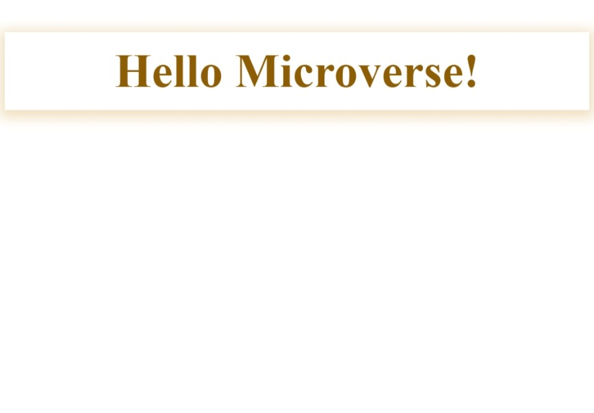

<a name="readme-top"></a>


<div align="center">
  
  <br/>
</div>

<!-- TABLE OF CONTENTS -->

# 📗 Table of Contents

- [📖 About the Project](#about-project)
  - [Screenshot](#screenshot)
  - [🛠 Built With](#built-with)
    - [Tech Stack](#tech-stack)
    - [Key Features](#key-features)
  - [🚀 Live Demo](#live-demo)
- [💻 Getting Started](#getting-started)
  - [Prerequisites](#prerequisites)
  - [Setup](#setup)
  - [Deployment](#deployment)
- [👥 Author](#authors)
- [🔭 Future Features](#future-features)
- [🤝 Contributing](#contributing)
- [⭐️ Show your support](#support)
- [🙏 Acknowledgements](#acknowledgements)
- [❓ FAQ (OPTIONAL)](#faq)
- [📝 License](#license)

<!-- PROJECT DESCRIPTION -->

# 📖 Hello-Microverse <a name="about-project"></a>

Hello-Microverse is the very first project of the 1st module of microverse full stack web development program.
It is a simple page that display the word "Hello Microverse!".

## Screenshot <a name="screenshot"></a>

The screenshot below is a desktop version of the design.
<div align="center">
<br/>

</div>

<p align="right">(<a href="#readme-top">back to top</a>)</p>

## 🛠 Built With <a name="built-with"></a>

### Tech Stack <a name="tech-stack"></a>

Hello-Microverse is build with:

- Semantic HTML5 markup to build raw structure of this web page
- CSS custom properties to make the website visually attractive
- [Node js](https://nodejs.org/en) as a javascript runtime machine
- [git], a free and open source distributed version control system
- Linters for coding convention and coding formating

<!-- Features -->

### Key Features <a name="key-features"></a>

- **Linters** have been set up in order to track possible errors from the HTML and CSS files
- **The stylesheet file** has been linked externaly

<p align="right">(<a href="#readme-top">back to top</a>)</p>

<!-- LIVE DEMO -->

## 🚀 Live Demo <a name="live-demo"></a>

> Unfortunatly, there is not live demonstration avalaible right now.

<p align="right">(<a href="#readme-top">back to top</a>)</p>

<!-- GETTING STARTED -->

## 💻 Getting Started <a name="getting-started"></a>

Before proceeding to the installation phase, you must ensure that you meet the following prerequisites...

### Prerequisites

- have a [Github account](https://github.com/)
- install the latest Long-term support version of [Node js](https://nodejs.org/en)
- install [Visual Studio Code](https://code.visualstudio.com/) and it extension _Live server_

### Setup

In order to run this project you need to:

- open your code editor
- create a folder with the name _my-folder_
- copy and paste the following code in your editor's terminal:
```sh
    cd my-folder
    git clone https://github.com/lily4178993/Hello-Microverse.git
```
- right-click on the _index.html_ file and select _Open with Live Server_

### Deployment

there are many ways to host your project for free:

- [GitHub Pages](https://pages.github.com/)
- [Vercel](https://vercel.com/)
- [Netlify](https://www.netlify.com/)

<p align="right">(<a href="#readme-top">back to top</a>)</p>

<!-- AUTHOR -->

## 👥 Author <a name="authors"></a>

Want to get in touch with me? Here are my social links:
> [GitHub](https://github.com/lily4178993/) 
> [Twitter](https://twitter.com/nelly_telli) 
> [LinkedIn](https://www.linkedin.com/in/nelly-t-330414266/)

<p align="right">(<a href="#readme-top">back to top</a>)</p>

<!-- FUTURE FEATURES -->

## 🔭 Future Features <a name="future-features"></a>

In the near future, I plan to add  and 

- [ ] **a slideshow**
- [ ] **a soundtrack** that will activate when you visit the web page

<p align="right">(<a href="#readme-top">back to top</a>)</p>

<!-- CONTRIBUTING -->

## 🤝 Contributing <a name="contributing"></a>

Contributions, issues, and feature requests are welcome!
Feel free to check the [issues page](https://github.com/lily4178993/Hello-Microverse/issues).

<p align="right">(<a href="#readme-top">back to top</a>)</p>

<!-- SUPPORT -->

## ⭐️ Show your support <a name="support"></a>

Do you like this project? 
Don't hesitate to vote! Kindly leave a comment below and share it with someone who enjoys coding!
This will help me gain visibility, but more importantly, it will facilitate access to other people.

<p align="right">(<a href="#readme-top">back to top</a>)</p>

<!-- ACKNOWLEDGEMENTS -->

## 🙏 Acknowledgments <a name="acknowledgements"></a>

I am grateful to [Microverse](https://github.com/microverseinc) for the opportunity they have given me.

<p align="right">(<a href="#readme-top">back to top</a>)</p>


<!-- LICENSE -->

## 📝 License <a name="license"></a>

This project is [MIT](./LICENSE.md) licensed.

<p align="right">(<a href="#readme-top">back to top</a>)</p>